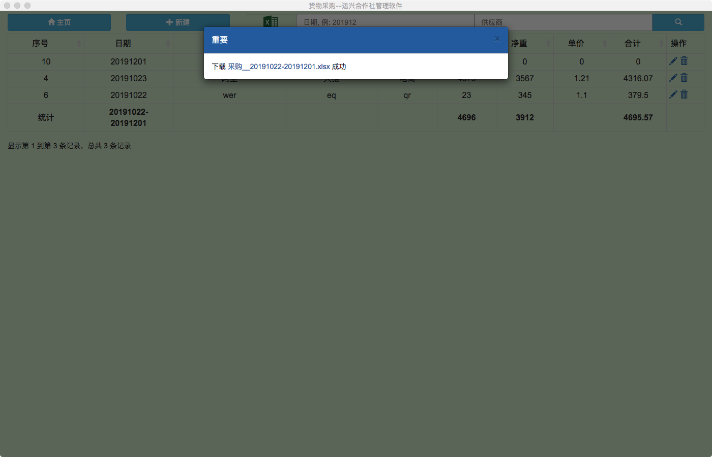
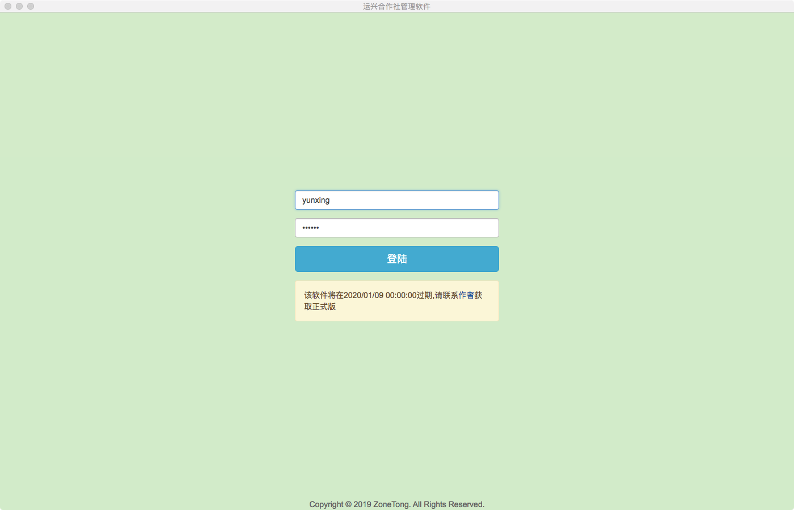
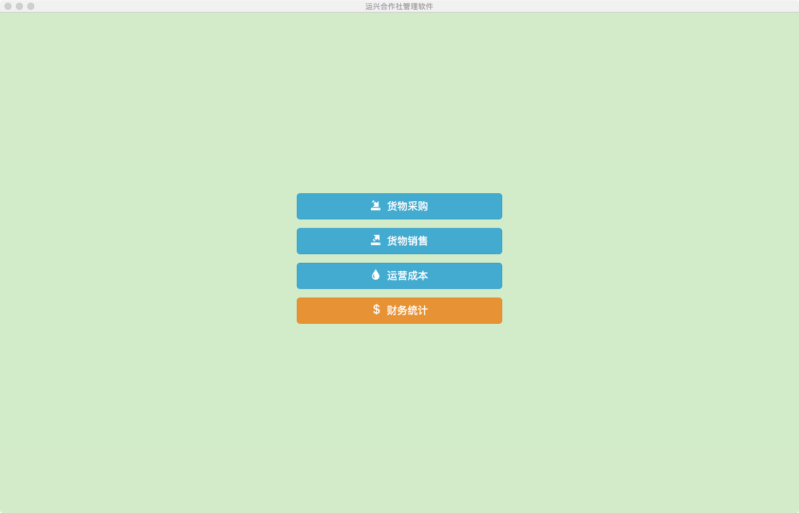
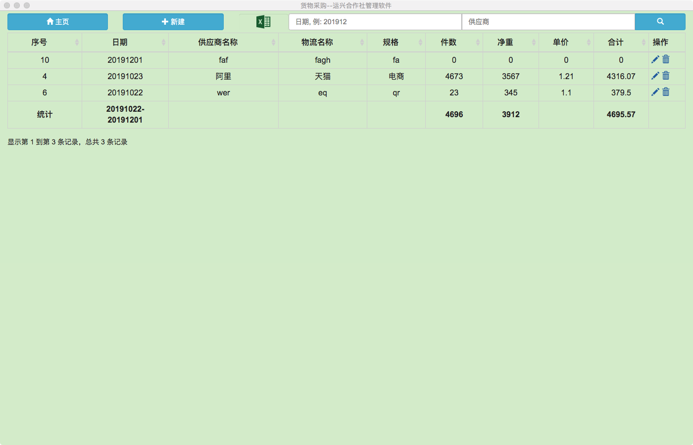
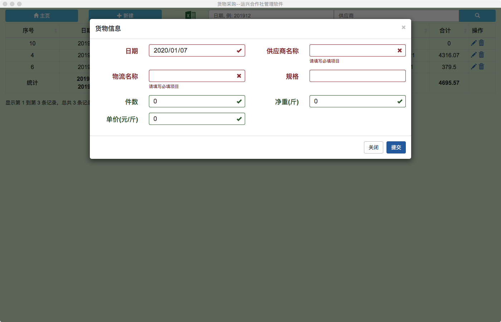

# yunxingningmeng

make golang ui by"github.com/zserge/lorca"

## 20191210 requirements

- remove module stock
- search by multiple columns
- static for module purchase/sale/cost
- export excel/csv

## 20191021 requirements

- login

- purchase

- sale
- cost
- stock
- finance
